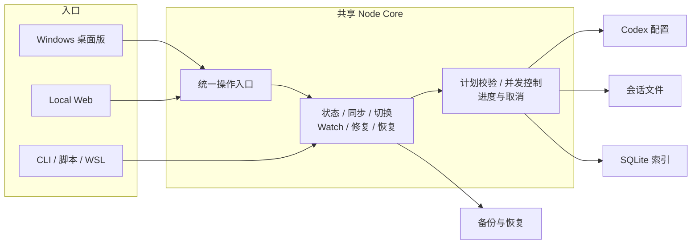

<div align="center">

# codex-provider-sync

### 切换 Provider 后，帮助 Codex 旧会话重新可用

[](https://github.com/Dailin521/codex-provider-sync/actions/workflows/ci.yml)
[](https://www.npmjs.com/package/@dailin521/codex-provider-sync)
[](https://github.com/Dailin521/codex-provider-sync/releases)
[](LICENSE)
[](https://linux.do/)

**中文** · [English](docs/README_EN.md) · [日本語](docs/README_JA.md) · [한국어](docs/README_KO.md)

</div>

## 它解决什么

切换 Provider 后，旧会话可能仍记录着原来的 Provider。本工具将**会话文件与 SQLite 聊天索引中的 Provider 信息**对齐到当前配置，解决元数据不一致的问题。

**不保证跨 Provider / 账号的旧会话一定能继续或压缩**，也不处理登录、认证或加密内容。信息已对齐时，无需重复同步。

<p align="center">
  
</p>

### 什么时候需要它

按你切换 Provider 的方式，选择对应操作：

- **已用 CCSwitch 等工具切换**：同步到当前配置中的 Provider。
- **希望在本工具中切换**：选择目标 Provider；工具会更新配置，再同步会话文件和索引中的 Provider。
- **Provider 信息已经一致**：不必重复同步；继续失败时应查看 Codex 的具体报错。

## 核心功能

- **同步与切换**：预览或直接同步，按需开启自动同步。
- **备份与恢复**：修改前自动备份，支持恢复和清理。
- **聊天与日志**：按项目浏览会话，查看操作结果和耗时。
- **存储与修复**：自定义数据位置，按需诊断和专项修复。

## 下载 Windows 桌面版

**Windows x64**，无需 Node.js。未签名；便携版须完整解压。

[下载最新正式版：安装版 / 便携 ZIP、版本说明与校验](https://github.com/Dailin521/codex-provider-sync/releases/latest)

macOS/Linux Electron 包尚未发布；CLI / Web 的 npm 版本独立发布。

## 日常使用

1. 打开“概览”，确认 **Provider、存储路径和同步状态**。
2. 已通过 CCSwitch 等工具切换 Provider：点击“预览同步”查看影响，或“直接同步”立即执行。
3. 查看结果。部分完成时，结束相关占用会话后重试；需要撤销时进入“备份 / 恢复”。

“单独切换 Provider”会修改配置并同步历史 Provider，不改历史模型；自定义 Provider 需预先配置。

修改前自动备份，默认保留最近 **2 份**，在“备份 / 恢复”中管理；无需修改时不备份，受保护备份不受数量限制。

[桌面完整指南](docs/README_DESKTOP_ZH.md) · [旧版迁移说明](docs/release-notes/v1.0.0-zh.md)

## 本地 Web UI

安装 Node.js `16.20.2+` 后运行，获得 npm 当前已发布的 CLI / Web 版本：

```bash
npm install -g @dailin521/codex-provider-sync
codex-provider web
```

默认只监听本机 `127.0.0.1:8791`，打开浏览器完成配对。跨设备使用见 [Web 指南与 SSH 用法](docs/README_WEB_UI_ZH.md)。

## CLI

安装同一个 npm 包后，先检查，再同步：

```bash
codex-provider status
codex-provider sync
```

CLI 写命令直接执行。切换 Provider、恢复备份、Watch、路径参数及 JSON 退出码见 [CLI 指南](docs/README_CLI_ZH.md)；命令是否可用以安装版本的 `--help` 为准。

## 一个核心，三个入口

Windows 桌面版、Local Web 和 CLI 使用同一套同步、切换、备份与恢复逻辑；选择入口只影响操作方式，不影响同步结果。



- **桌面版**：日常双击使用。
- **Local Web**：在浏览器中操作，适合跨平台环境。
- **CLI**：适合脚本、自动化和 WSL。

普通同步只对齐 Provider；专项修复和恢复需要明确选择。旧 .NET Windows/macOS 版仍作为兼容实现维护。

开发者可查看[当前 Node Core 架构](docs/architecture/NODE_CORE_ARCHITECTURE_ZH.md)和 [Electron + Node 架构基线](docs/VNEXT_ELECTRON_NODE_ARCHITECTURE_ZH.md)。

## 同步如何读写，速度取决于什么

同步只解析每个会话的首行元数据，并对齐会话文件和 SQLite 中的 Provider；聊天正文保持不变。

- **满足原地写条件（包括 Provider 字节等长）**：直接改写 Provider，无需为替换生成整份会话副本。
- **其他有效首行**：更新首行后流式复制正文到新文件，再替换原文件。

这两种方式会自动选择，无需设置加速选项，也不必把 Provider 名称改成相同长度。

速度主要取决于需要更新的会话数量；Provider 长度不同且历史文件较大时，还需要复制正文，耗时会增加。备份、写前校验、落盘和时间戳恢复也会占用时间。操作日志可查看各步骤耗时。

[工作原理与路径解析](docs/WORKING_PRINCIPLE_ZH.md) · [Provider I/O 不变量](docs/architecture/NODE_CORE_ARCHITECTURE_ZH.md#3-provider-io-不变量必须保持)

## 常见问题（FAQ）

### 已经用 CCSwitch 切换了，还需要做什么？

打开本工具，确认当前 Provider 是你要使用的，再点击“同步”。如果会话文件和索引中的 Provider 已经一致，就无需重复同步。

### 同步会修改聊天内容或登录信息吗？

不会。同步只对齐会话文件和 SQLite 索引中的 Provider，不修改聊天正文、历史模型或会话排序时间，也不读取或修改登录文件 `auth.json`。

### 为什么同步后，旧会话仍无法继续？

Provider 一致只是继续会话的一个条件。请查看 Codex 的具体报错；若涉及加密内容或模型兼容问题，可回到原 Provider / 账号，或新建会话。

### 显示“部分完成”怎么办？

先查看结果或操作日志中的原因。异常会话会跳过并保留关联索引，正常会话继续处理：格式或大小问题需处理数据后重新预览；占用或变化可等会话停止写入后再同步。已完成的修改不会自动全量回滚。

### 同步错了，如何恢复？

在“备份”中选择对应操作前的备份并恢复；CLI 可使用 `codex-provider restore <backup-dir>`。具体步骤见[桌面指南](docs/README_DESKTOP_ZH.md)或 [CLI 指南](docs/README_CLI_ZH.md)。

路径配置与 WSL 用法见 [CLI 指南](docs/README_CLI_ZH.md)；同步耗时说明见[工作原理](docs/WORKING_PRINCIPLE_ZH.md)。

## 文档与开发

- 用户指南：[桌面中文](docs/README_DESKTOP_ZH.md) / [English](docs/README_DESKTOP_EN.md) · [Web](docs/README_WEB_UI_ZH.md) · [CLI](docs/README_CLI_ZH.md)
- [完整文档索引](docs/README_ZH.md) · [更新日志](CHANGELOG.md) · [反馈问题](https://github.com/Dailin521/codex-provider-sync/issues)
- [工作原理](docs/WORKING_PRINCIPLE_ZH.md) · [当前 Node Core 架构与读写约束](docs/architecture/NODE_CORE_ARCHITECTURE_ZH.md)
- [贡献与构建指南](CONTRIBUTING.md) · [迁移与发布门禁](docs/migration/VNEXT_MIGRATION_EXECUTION_INDEX_ZH.md) · [AI / Agent 指南](AGENTS.md)

源码开发使用 Node 24：

```bash
npm ci
npm run architecture:check
npm test
npm run web:build
npm run desktop:build
```

开发时先读当前架构，再查对应合同、ADR 与测试。构建成功不等于完成所有平台的发布验收。

## 致谢与许可

感谢 [@tangquanwei](https://github.com/tangquanwei) 贡献本地 Web UI、聊天记录浏览和多语言文档基础，并通过 [PR #80](https://github.com/Dailin521/codex-provider-sync/pull/80) 带入 v0.5.0；感谢所有参与贡献和问题调查的朋友。

[贡献者](CONTRIBUTORS.md) · [GitHub Contributors](https://github.com/Dailin521/codex-provider-sync/graphs/contributors) · [LINUX DO 社区](https://linux.do/) · [MIT License](LICENSE)
